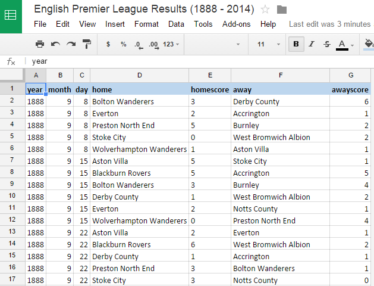
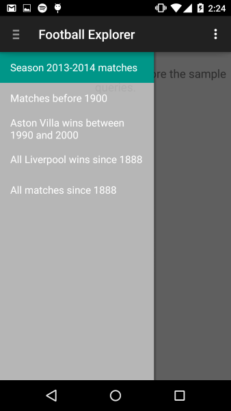
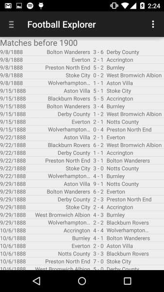
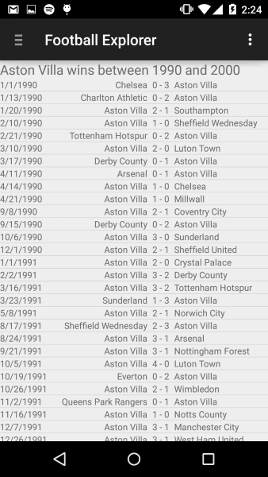
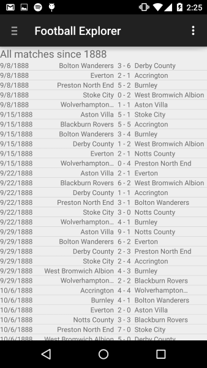

# Using Google Spreadsheets as a Data Source for Your Android App (Part 2)

In [Part 1](https://github.com/telerik/Android-samples/tree/master/Blogs/Json-Reader) we saw how to treat any public Google spreadsheet as a queryable data table and get the response back as JSON.  

In this post, I’ll show you how to filter the data before pulling it from the server. This is very useful for situations in which you have to deal with large amounts of data.

The Google Query Language provides an easy way to filter the data on the server by embedding SQL-like statements in the URL.

http://spreadsheets.google.com/tq?tq=**QUERY**&key=**SPREADSHEET_ID**

Note: The default response is in JSON but can be modified to return an HTML table, which is useful for debugging purposes.

http://spreadsheets.google.com/tq?tqx=out:**HTML**&tq=**QUERY**&key=**SPREADSHEET_ID**

In this example we’ll be using a spreadsheet that contains every single match in the English Premier League since 1888 - a total of 46,940 rows. 

[English Football League Results (1888 - 2014)](https://docs.google.com/spreadsheets/d/1o728ZECFa8A05nqlN50e9aPicnYheb26SS2gMwVMxsE)

The size of the entire sheet, when downloaded, reaches 6.3 MB. Transferring so much data back and forth will have a negative impact on your application's network bandwidth. To limit the size of data you pull from the server, you can use SQL-like statements embedded in the post URL. 

## Downloading the Entire Sheet

This is the most basic query we can execute against a spreadsheet. With the select * statement, you can download all the matches since 1888.

[SELECT *](http://spreadsheets.google.com/tq?tqx=out:HTML&tq=select%20%2A&key=1o728ZECFa8A05nqlN50e9aPicnYheb26SS2gMwVMxsE) ← click select to see the result as an HTML table.

## Selecting Particular Columns

It's important to note that columns are referenced by the identifiers (not by labels). For example, in a Google Spreadsheet, column identifiers are the one- or two-character column letter (A, B, C, ...). Therefore, year is A, month is B, home is D and so on. 

Selecting just the year, home team and away team of each match becomes:

[SELECT A, D, F](http://spreadsheets.google.com/tq?tqx=out:HTML&tq=select%20A%2CD%2CF&key=1o728ZECFa8A05nqlN50e9aPicnYheb26SS2gMwVMxsE)

## Filtering the Result Using the WHERE Clause

The Google Query Language supports all the basic clauses: select, where, group by, order by and so on.

Getting all matches before 1900:

[SELECT A, D, E, F, G WHERE  A < 1900](http://spreadsheets.google.com/tq?tqx=out:HTML&tq=select%20A%2C%20D%2C%20E%2C%20F%2C%20G%20where%20A%20%3C%201900&key=1o728ZECFa8A05nqlN50e9aPicnYheb26SS2gMwVMxsE)  

## Getting the Wins of Aston Villa Between 1990 and 2000:

[SELECT * WHERE (A >= 1990 AND A <= 2000) AND ((D CONTAINS 'Aston Villa' AND E>G) OR (F CONTAINS 'Aston Villa' AND G > E))](http://spreadsheets.google.com/tq?tqx=out:HTML&tq=select%20%2A%20where%20%28A%20%3E%3D%201990%20and%20A%20%3C%3D%202000%29%20and%20%28%28D%20contains%20%27Aston%20Villa%27%20and%20E%3EG%29%20or%20%28F%20contains%20%27Aston%20Villa%27%20and%20G%20%3E%20E%29%29&key=1o728ZECFa8A05nqlN50e9aPicnYheb26SS2gMwVMxsE) 

There's a lot you can do with the Google Query Language, but there's also a lot missing. If you want to explore the language in depth, please visit the [Google Query Language documentation page](https://developers.google.com/chart/interactive/docs/querylanguage).

